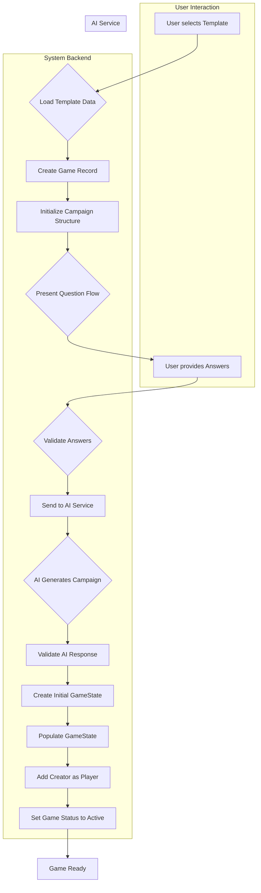

# Template-to-Game Creation Process

This document outlines the step-by-step process for creating a new game instance from a selected template in QuestForge.

## Process Flow

## Detailed Steps

1.  **Template Selection (User Action):**
    *   The user navigates to the game creation interface (e.g., `/game/create`).
    *   The user selects a desired template from the list presented (fetched via `questforge/views/template.py`).

2.  **Load Template Data (System):**
    *   The system retrieves the selected `Template` object from the database (`questforge/models/template.py`).
    *   Key data loaded includes: `name`, `description`, `question_flow` (JSON), `default_rules` (JSON), `initial_state` (JSON), `ai_service_endpoint`.

3.  **Create Game Record (System):**
    *   A new `Game` record is created in the database (`questforge/models/game.py`).
    *   It's linked to the selected `template_id` and the `created_by` user ID.
    *   Initial status might be 'pending' or 'initializing'.

4.  **Initialize Campaign Structure (System):**
    *   A new `Campaign` record is created (`questforge/models/campaign.py`), linked to the new `game_id`.
    *   The `campaign_data` and other structure fields (`objectives`, `key_locations`, etc.) are initialized using the `initial_state` JSON from the selected `Template`.

5.  **Present Question Flow (System to User):**
    *   The system parses the `question_flow` JSON from the `Template`.
    *   The questions defined in the flow are presented to the user via the UI (likely using JavaScript fetched from `/api/template/<template_id>/questions` handled by `questforge/views/campaign_api.py`).

6.  **User Provides Answers (User Action):**
    *   The user answers the presented questions, providing customization details for their specific game instance.

7.  **Validate Answers (System - *Optional/Future*):**
    *   *(Currently deferred per `activeContext.md`)* The system could optionally validate user answers against rules defined in the `Template`'s `default_rules` or specific question constraints.

8.  **Send to AI Service (System):**
    *   The system prepares a prompt for the AI service, including:
        *   The base template information/structure.
        *   The user's answers to the question flow.
    *   The request is sent to the `ai_service_endpoint` defined in the `Template`, likely orchestrated by `questforge/services/campaign_service.py` calling `questforge/services/ai_service.py`.
    *   The `Template` model's `generate_ai_content` method handles the actual HTTP request, including retry logic.

9.  **AI Generates Campaign (AI Service):**
    *   The external AI service processes the prompt and generates the detailed campaign structure (narrative, plot points, characters, locations, objectives, conclusion conditions, branches).

10. **Validate AI Response (System):**
    *   The system receives the response from the AI service.
    *   The `Template` model's `validate_ai_response` method checks if the response has the basic required structure. *(Further validation of content quality might be needed)*.
    *   The raw response is stored in the `Template`'s `ai_last_response` field.

11. **Create Initial GameState (System):**
    *   A new `GameState` record is created (`questforge/models/game_state.py`), linked to the `game_id` and the `campaign_id`.

12. **Populate GameState (System):**
    *   The system parses the validated AI response.
    *   The generated campaign details (objectives, locations, characters, plot points, etc.) from the AI response are used to update the corresponding fields in the `Campaign` record.
    *   The initial state fields in the `GameState` record are set (e.g., `current_location`, `current_branch`, initializing tracking arrays like `completed_objectives` to empty).

13. **Add Creator as Player (System):**
    *   The user who initiated the creation is added to the game's player list (using the `game_players` association table).

14. **Set Game Status to Active (System):**
    *   The `status` field of the `Game` record is updated to 'active'.

15. **Game Ready:**
    *   The game is now fully initialized and ready for players to join via the lobby and begin playing. Real-time updates via SocketIO are active.

## Related Components

*   **Models:** `Template`, `Game`, `Campaign`, `GameState`, `User`
*   **Views:** `questforge/views/game.py`, `questforge/views/template.py`, `questforge/views/campaign_api.py`
*   **Services:** `questforge/services/campaign_service.py`, `questforge/services/ai_service.py`
*   **UI:** Templates in `questforge/templates/game/create.html`, related JavaScript.

## SocketIO Implementation Details (Lobby & Play)

*   **Purpose:** Real-time communication for lobby updates (player join/leave/ready status) and gameplay events.
*   **Server-Side (`socket_service.py`):**
    *   Handles events like `connect`, `join_game`, `leave_game`, `player_ready`, `start_game`, `player_action`, `request_state`.
    *   Uses `emit` to broadcast events to specific rooms (identified by `game_id`).
    *   Interacts with the database (`GamePlayer`, `Game`) to update player status and game state.
*   **Client-Side Structure (Final Working Approach):**
    *   **Lobby (`lobby.html`):** All necessary Socket.IO logic (connection, event listeners, UI updates) is embedded directly within a `<script type="module">` block. This avoids potential issues with external module loading and syntax parsing in some browser environments. The global `io()` function is used to establish the connection, and event listeners (`socket.on(...)`) are attached directly to the `socket` object created within this script block.
    *   **Gameplay (`play.html`):** Imports a non-class-based JavaScript object module (`socketClient.mjs`). This object (`socketClient`) acts as a wrapper for the Socket.IO connection and provides methods like `connect`, `joinRoom`, `emitPlayerReady`, etc. It uses an internal `onConnectCallbacks` array to manage actions that should occur after a successful connection.
    *   **`socketClient.mjs`:** Contains a plain JavaScript object (`socketClient`) with functions for managing the connection (`connect`, `disconnect`), joining rooms (`joinRoom`), emitting events (`emitPlayerReady`), and handling incoming events (`player_list`, `player_joined`, `player_left`, `player_status_update`, `game_started`). It uses `function` syntax instead of ES6 class methods to avoid potential browser parsing issues. It exposes `onConnectCallbacks` and `onDisconnectCallbacks` arrays for other scripts to register functions to run upon connection/disconnection.
*   **Key Client-Side Logic Points:**
    *   **Global User ID:** Both `lobby.html` and `play.html` **must** set the `window.currentUserId` variable using the Jinja template (`window.currentUserId = '{{ user_id }}';` or `window.currentUserId = '{{ current_user_id }}';`). This global variable is used by `socketClient.mjs` (specifically in `joinRoom` and `emitPlayerReady`) and potentially inline scripts to send the correct user ID to the server. Failure to set this globally results in "Missing game_id or user_id" errors from the server.
    *   **Connection:**
        *   In `lobby.html`, `connectSocket()` is called directly, which initializes `socket = io(...)`.
        *   In `play.html`, `socketClient.connect(gameId)` is called.
    *   **Joining Room:**
        *   In `lobby.html`, `socket.emit('join_game', ...)` is called within the `socket.on('connect', ...)` handler.
        *   In `play.html`, `socketClient.joinRoom(gameId)` is called within the `setupListenersAndRequestState` function, which is pushed to `socketClient.onConnectCallbacks` and executed by `socketClient.connect` upon successful connection.
    *   **Ready Status (`lobby.html`):**
        *   Clicking "Ready Up" calls `emitPlayerReady()` (defined inline).
        *   The server handles `player_ready`, updates the DB, and emits `player_status_update`.
        *   The client listens for `player_status_update` and calls `handlePlayerStatusUpdate()` to update the UI (✅/❌) and check if the "Start Game" button should be enabled (`checkAllPlayersReady()`).
    *   **Start Game (`lobby.html`):**
        *   Clicking "Start Game" emits `start_game`.
        *   The server handles `start_game`, validates conditions, updates game status, and emits `game_started`.
        *   The client listens for `game_started` and redirects to the `play.html` page.
    *   **Gameplay (`play.html`):**
        *   After connection (managed via `socketClient.onConnectCallbacks`), listeners for `game_state_update` and `game_state` are set up.
        *   `request_state` is emitted to get the initial game state (requires `game_id` and `user_id`).
        *   UI functions (`updateGameState`, `updateActionControls`, `updateGameLog`, `renderGameState`) handle displaying game information.
        *   Clicking action buttons calls `performAction`, which emits `player_action`.
*   **Lessons Learned & Debugging:**
    *   **External Modules & Syntax:** Browsers can be sensitive to ES6 class syntax in external `.js` or `.mjs` files loaded as modules. Persistent `Unexpected token '{'` errors might indicate parsing issues unrelated to the code's correctness. Embedding logic directly (`lobby.html`) or using simpler object structures (`socketClient.mjs` for `play.html`) can resolve this.
    *   **Global Scope:** Ensure necessary data (like `user_id`) is accessible in the correct scope (e.g., using `window.currentUserId`) when needed by imported modules or event handlers. Missing data can lead to server-side errors like "Missing game_id or user_id".
    *   **Event Flow:** Trace events meticulously from client emission -> server handling -> server emission -> client reception -> client UI update. Use console logs on both client and server.
    *   **Server Logs:** Check the terminal running the Flask app for server-side logs, including Socket.IO emissions.
    *   **Client Logs:** Check the browser's developer console for client-side logs and errors.
    *   **Room Subscription:** Verify clients join the correct Socket.IO room (`game_id`) and that the server emits events to that specific room.

## SocketIO Implementation Details (Lobby & Play)

*   **Purpose:** Real-time communication for lobby updates (player join/leave/ready status) and gameplay events.
*   **Server-Side (`socket_service.py`):**
    *   Handles events like `connect`, `join_game`, `leave_game`, `player_ready`, `start_game`, `player_action`, `request_state`.
    *   Uses `emit` to broadcast events to specific rooms (identified by `game_id`).
    *   Interacts with the database (`GamePlayer`, `Game`) to update player status and game state.
*   **Client-Side Structure (Final Working Approach):**
    *   **Lobby (`lobby.html`):** All necessary Socket.IO logic (connection, event listeners, UI updates) is embedded directly within a `<script type="module">` block. This avoids potential issues with external module loading and syntax parsing in some browser environments. The global `io()` function is used to establish the connection, and event listeners (`socket.on(...)`) are attached directly to the `socket` object created within this script block.
    *   **Gameplay (`play.html`):** Imports a non-class-based JavaScript object module (`socketClient.mjs`). This object (`socketClient`) acts as a wrapper for the Socket.IO connection and provides methods like `connect`, `joinRoom`, `emitPlayerReady`, etc. It uses an internal `onConnectCallbacks` array to manage actions that should occur after a successful connection.
    *   **`socketClient.mjs`:** Contains a plain JavaScript object (`socketClient`) with functions for managing the connection (`connect`, `disconnect`), joining rooms (`joinRoom`), emitting events (`emitPlayerReady`), and handling incoming events (`player_list`, `player_joined`, `player_left`, `player_status_update`, `game_started`). It uses `function` syntax instead of ES6 class methods to avoid potential browser parsing issues. It exposes `onConnectCallbacks` and `onDisconnectCallbacks` arrays for other scripts to register functions to run upon connection/disconnection.
*   **Key Client-Side Logic Points:**
    *   **Global User ID:** Both `lobby.html` and `play.html` **must** set the `window.currentUserId` variable using the Jinja template (`window.currentUserId = '{{ user_id }}';` or `window.currentUserId = '{{ current_user_id }}';`). This global variable is used by `socketClient.mjs` (specifically in `joinRoom` and `emitPlayerReady`) and potentially inline scripts to send the correct user ID to the server. Failure to set this globally results in "Missing game_id or user_id" errors from the server.
    *   **Connection:**
        *   In `lobby.html`, `connectSocket()` is called directly, which initializes `socket = io(...)`.
        *   In `play.html`, `socketClient.connect(gameId)` is called.
    *   **Joining Room:**
        *   In `lobby.html`, `socket.emit('join_game', ...)` is called within the `socket.on('connect', ...)` handler.
        *   In `play.html`, `socketClient.joinRoom(gameId)` is called within the `setupListenersAndRequestState` function, which is pushed to `socketClient.onConnectCallbacks` and executed by `socketClient.connect` upon successful connection.
    *   **Ready Status (`lobby.html`):**
        *   Clicking "Ready Up" calls `emitPlayerReady()` (defined inline).
        *   The server handles `player_ready`, updates the DB, and emits `player_status_update`.
        *   The client listens for `player_status_update` and calls `handlePlayerStatusUpdate()` to update the UI (✅/❌) and check if the "Start Game" button should be enabled (`checkAllPlayersReady()`).
    *   **Start Game (`lobby.html`):**
        *   Clicking "Start Game" emits `start_game`.
        *   The server handles `start_game`, validates conditions, updates game status, and emits `game_started`.
        *   The client listens for `game_started` and redirects to the `play.html` page.
    *   **Gameplay (`play.html`):**
        *   After connection (managed via `socketClient.onConnectCallbacks`), listeners for `game_state_update` and `game_state` are set up.
        *   `request_state` is emitted to get the initial game state (requires `game_id` and `user_id`).
        *   UI functions (`updateGameState`, `updateActionControls`, `updateGameLog`, `renderGameState`) handle displaying game information.
        *   Clicking action buttons calls `performAction`, which emits `player_action`.
*   **Lessons Learned & Debugging:**
    *   **External Modules & Syntax:** Browsers can be sensitive to ES6 class syntax in external `.js` or `.mjs` files loaded as modules. Persistent `Unexpected token '{'` errors might indicate parsing issues unrelated to the code's correctness. Embedding logic directly (`lobby.html`) or using simpler object structures (`socketClient.mjs` for `play.html`) can resolve this.
    *   **Global Scope:** Ensure necessary data (like `user_id`) is accessible in the correct scope (e.g., using `window.currentUserId`) when needed by imported modules or event handlers. Missing data can lead to server-side errors like "Missing game_id or user_id".
    *   **Event Flow:** Trace events meticulously from client emission -> server handling -> server emission -> client reception -> client UI update. Use console logs on both client and server.
    *   **Server Logs:** Check the terminal running the Flask app for server-side logs, including Socket.IO emissions.
    *   **Client Logs:** Check the browser's developer console for client-side logs and errors.
    *   **Room Subscription:** Verify clients join the correct Socket.IO room (`game_id`) and that the server emits events to that specific room.

## SocketIO Implementation Details (Lobby & Play)

*   **Purpose:** Real-time communication for lobby updates (player join/leave/ready status) and gameplay events.
*   **Server-Side (`socket_service.py`):**
    *   Handles events like `connect`, `join_game`, `leave_game`, `player_ready`, `start_game`, `player_action`, `request_state`.
    *   Uses `emit` to broadcast events to specific rooms (identified by `game_id`).
    *   Interacts with the database (`GamePlayer`, `Game`) to update player status and game state.
*   **Client-Side Structure (Final Working Approach):**
    *   **Lobby (`lobby.html`):** All necessary Socket.IO logic (connection, event listeners, UI updates) is embedded directly within a `<script type="module">` block. This avoids potential issues with external module loading and syntax parsing in some browser environments. The global `io()` function is used to establish the connection, and event listeners (`socket.on(...)`) are attached directly to the `socket` object created within this script block.
    *   **Gameplay (`play.html`):** Imports a non-class-based JavaScript object module (`socketClient.mjs`). This object (`socketClient`) acts as a wrapper for the Socket.IO connection and provides methods like `connect`, `joinRoom`, `emitPlayerReady`, etc. It uses an internal `onConnectCallbacks` array to manage actions that should occur after a successful connection.
    *   **`socketClient.mjs`:** Contains a plain JavaScript object (`socketClient`) with functions for managing the connection (`connect`, `disconnect`), joining rooms (`joinRoom`), emitting events (`emitPlayerReady`), and handling incoming events (`player_list`, `player_joined`, `player_left`, `player_status_update`, `game_started`). It uses `function` syntax instead of ES6 class methods to avoid potential browser parsing issues. It exposes `onConnectCallbacks` and `onDisconnectCallbacks` arrays for other scripts to register functions to run upon connection/disconnection.
*   **Key Client-Side Logic Points:**
    *   **Global User ID:** Both `lobby.html` and `play.html` **must** set the `window.currentUserId` variable using the Jinja template (`window.currentUserId = '{{ user_id }}';` or `window.currentUserId = '{{ current_user_id }}';`). This global variable is used by `socketClient.mjs` (specifically in `joinRoom` and `emitPlayerReady`) and potentially inline scripts to send the correct user ID to the server. Failure to set this globally results in "Missing game_id or user_id" errors from the server.
    *   **Connection:**
        *   In `lobby.html`, `connectSocket()` is called directly, which initializes `socket = io(...)`.
        *   In `play.html`, `socketClient.connect(gameId)` is called.
    *   **Joining Room:**
        *   In `lobby.html`, `socket.emit('join_game', ...)` is called within the `socket.on('connect', ...)` handler.
        *   In `play.html`, `socketClient.joinRoom(gameId)` is called within the `setupListenersAndRequestState` function, which is pushed to `socketClient.onConnectCallbacks` and executed by `socketClient.connect` upon successful connection.
    *   **Ready Status (`lobby.html`):**
        *   Clicking "Ready Up" calls `emitPlayerReady()`.
        *   The server handles `player_ready`, updates the DB, and emits `player_status_update`.
        *   The client listens for `player_status_update` and calls `handlePlayerStatusUpdate()` to update the UI (✅/❌) and check if the "Start Game" button should be enabled (`checkAllPlayersReady()`).
    *   **Start Game (`lobby.html`):**
        *   Clicking "Start Game" emits `start_game`.
        *   The server handles `start_game`, validates conditions, updates game status, and emits `game_started`.
        *   The client listens for `game_started` and redirects to the `play.html` page.
    *   **Gameplay (`play.html`):**
        *   After connection (managed via `socketClient.onConnectCallbacks`), listeners for `game_state_update` and `game_state` are set up.
        *   `request_state` is emitted to get the initial game state (requires `game_id` and `user_id`).
        *   UI functions (`updateGameState`, `updateActionControls`, `updateGameLog`, `renderGameState`) handle displaying game information.
        *   Clicking action buttons calls `performAction`, which emits `player_action`.
*   **Lessons Learned & Debugging:**
    *   **External Modules & Syntax:** Browsers can be sensitive to ES6 class syntax in external `.js` or `.mjs` files loaded as modules. Persistent `Unexpected token '{'` errors might indicate parsing issues unrelated to the code's correctness. Embedding logic directly (`lobby.html`) or using simpler object structures (`socketClient.mjs` for `play.html`) can resolve this.
    *   **Global Scope:** Ensure necessary data (like `user_id`) is accessible in the correct scope (e.g., using `window.currentUserId`) when needed by imported modules or event handlers. Missing data can lead to server-side errors like "Missing game_id or user_id".
    *   **Event Flow:** Trace events meticulously from client emission -> server handling -> server emission -> client reception -> client UI update. Use console logs on both client and server.
    *   **Server Logs:** Check the terminal running the Flask app for server-side logs, including Socket.IO emissions.
    *   **Client Logs:** Check the browser's developer console for client-side logs and errors.
    *   **Room Subscription:** Verify clients join the correct Socket.IO room (`game_id`) and that the server emits events to that specific room.

## SocketIO Implementation Details (Lobby & Play)

*   **Purpose:** Real-time communication for lobby updates (player join/leave/ready status) and gameplay events.
*   **Server-Side (`socket_service.py`):**
    *   Handles events like `connect`, `join_game`, `leave_game`, `player_ready`, `start_game`, `player_action`, `request_state`.
    *   Uses `emit` to broadcast events to specific rooms (identified by `game_id`).
    *   Interacts with the database (`GamePlayer`, `Game`) to update player status and game state.
*   **Client-Side Structure (Final Working Approach):**
    *   **Lobby (`lobby.html`):** All necessary Socket.IO logic (connection, event listeners, UI updates) is embedded directly within a `<script type="module">` block. This avoids potential issues with external module loading and syntax parsing in some browser environments. The global `io()` function is used to establish the connection, and event listeners (`socket.on(...)`) are attached directly to the `socket` object created within this script block.
    *   **Gameplay (`play.html`):** Imports a non-class-based JavaScript object module (`socketClient.mjs`). This object (`socketClient`) acts as a wrapper for the Socket.IO connection and provides methods like `connect`, `joinRoom`, `emitPlayerReady`, etc. It uses an internal `onConnectCallbacks` array to manage actions that should occur after a successful connection.
    *   **`socketClient.mjs`:** Contains a plain JavaScript object (`socketClient`) with functions for managing the connection (`connect`, `disconnect`), joining rooms (`joinRoom`), emitting events (`emitPlayerReady`), and handling incoming events (`player_list`, `player_joined`, `player_left`, `player_status_update`, `game_started`). It uses `function` syntax instead of ES6 class methods to avoid potential browser parsing issues. It exposes `onConnectCallbacks` and `onDisconnectCallbacks` arrays for other scripts to register functions to run upon connection/disconnection.
*   **Key Client-Side Logic Points:**
    *   **Global User ID:** Both `lobby.html` and `play.html` **must** set the `window.currentUserId` variable using the Jinja template (`window.currentUserId = '{{ user_id }}';` or `window.currentUserId = '{{ current_user_id }}';`). This global variable is used by `socketClient.mjs` (specifically in `joinRoom` and `emitPlayerReady`) and potentially inline scripts to send the correct user ID to the server. Failure to set this globally results in "Missing game_id or user_id" errors from the server.
    *   **Connection:**
        *   In `lobby.html`, `connectSocket()` is called directly, which initializes `socket = io(...)`.
        *   In `play.html`, `socketClient.connect(gameId)` is called.
    *   **Joining Room:**
        *   In `lobby.html`, `socket.emit('join_game', ...)` is called within the `socket.on('connect', ...)` handler.
        *   In `play.html`, `socketClient.joinRoom(gameId)` is called within the `setupListenersAndRequestState` function, which is pushed to `socketClient.onConnectCallbacks` and executed by `socketClient.connect` upon successful connection.
    *   **Ready Status (`lobby.html`):**
        *   Clicking "Ready Up" calls `emitPlayerReady()`.
        *   The server handles `player_ready`, updates the DB, and emits `player_status_update`.
        *   The client listens for `player_status_update` and calls `handlePlayerStatusUpdate()` to update the UI (✅/❌) and check if the "Start Game" button should be enabled (`checkAllPlayersReady()`).
    *   **Start Game (`lobby.html`):**
        *   Clicking "Start Game" emits `start_game`.
        *   The server handles `start_game`, validates conditions, updates game status, and emits `game_started`.
        *   The client listens for `game_started` and redirects to the `play.html` page.
    *   **Gameplay (`play.html`):**
        *   After connection (managed via `socketClient.onConnectCallbacks`), listeners for `game_state_update` and `game_state` are set up.
        *   `request_state` is emitted to get the initial game state (requires `game_id` and `user_id`).
        *   UI functions (`updateGameState`, `updateActionControls`, `updateGameLog`, `renderGameState`) handle displaying game information.
        *   Clicking action buttons calls `performAction`, which emits `player_action`.
*   **Lessons Learned & Debugging:**
    *   **External Modules & Syntax:** Browsers can be sensitive to ES6 class syntax in external `.js` or `.mjs` files loaded as modules. Persistent `Unexpected token '{'` errors might indicate parsing issues unrelated to the code's correctness. Embedding logic directly (`lobby.html`) or using simpler object structures (`socketClient.mjs` for `play.html`) can resolve this.
    *   **Global Scope:** Ensure necessary data (like `user_id`) is accessible in the correct scope (e.g., using `window.currentUserId`) when needed by imported modules or event handlers. Missing data can lead to server-side errors like "Missing game_id or user_id".
    *   **Event Flow:** Trace events meticulously from client emission -> server handling -> server emission -> client reception -> client UI update. Use console logs on both client and server.
    *   **Server Logs:** Check the terminal running the Flask app for server-side logs, including Socket.IO emissions.
    *   **Client Logs:** Check the browser's developer console for client-side logs and errors.
    *   **Room Subscription:** Verify clients join the correct Socket.IO room (`game_id`) and that the server emits events to that specific room.

## SocketIO Implementation Details (Lobby & Play)

*   **Purpose:** Real-time communication for lobby updates (player join/leave/ready status) and gameplay events.
*   **Server-Side (`socket_service.py`):**
    *   Handles events like `connect`, `join_game`, `leave_game`, `player_ready`, `start_game`, `player_action`, `request_state`.
    *   Uses `emit` to broadcast events to specific rooms (identified by `game_id`).
    *   Interacts with the database (`GamePlayer`, `Game`) to update player status and game state.
*   **Client-Side Structure (Final Working Approach):**
    *   **Lobby (`lobby.html`):** All necessary Socket.IO logic (connection, event listeners, UI updates) is embedded directly within a `<script type="module">` block. This avoids potential issues with external module loading and syntax parsing in some browser environments. The global `io()` function is used to establish the connection, and event listeners (`socket.on(...)`) are attached directly to the `socket` object created within this script block.
    *   **Gameplay (`play.html`):** Imports a non-class-based JavaScript object module (`socketClient.mjs`). This object (`socketClient`) acts as a wrapper for the Socket.IO connection and provides methods like `connect`, `joinRoom`, `emitPlayerReady`, etc. It uses an internal `onConnectCallbacks` array to manage actions that should occur after a successful connection.
    *   **`socketClient.mjs`:** Contains a plain JavaScript object (`socketClient`) with functions for managing the connection (`connect`, `disconnect`), joining rooms (`joinRoom`), emitting events (`emitPlayerReady`), and handling incoming events (`player_list`, `player_joined`, `player_left`, `player_status_update`, `game_started`). It uses `function` syntax instead of ES6 class methods to avoid potential browser parsing issues. It exposes `onConnectCallbacks` and `onDisconnectCallbacks` arrays for other scripts to register functions to run upon connection/disconnection.
*   **Key Client-Side Logic Points:**
    *   **Global User ID:** Both `lobby.html` and `play.html` **must** set the `window.currentUserId` variable using the Jinja template (`window.currentUserId = '{{ user_id }}';` or `window.currentUserId = '{{ current_user_id }}';`). This global variable is used by `socketClient.mjs` (specifically in `joinRoom` and `emitPlayerReady`) and potentially inline scripts to send the correct user ID to the server. Failure to set this globally results in "Missing game_id or user_id" errors from the server.
    *   **Connection:**
        *   In `lobby.html`, `connectSocket()` is called directly, which initializes `socket = io(...)`.
        *   In `play.html`, `socketClient.connect(gameId)` is called.
    *   **Joining Room:**
        *   In `lobby.html`, `socket.emit('join_game', ...)` is called within the `socket.on('connect', ...)` handler.
        *   In `play.html`, `socketClient.joinRoom(gameId)` is called within the `setupListenersAndRequestState` function, which is pushed to `socketClient.onConnectCallbacks` and executed by `socketClient.connect` upon successful connection.
    *   **Ready Status (`lobby.html`):**
        *   Clicking "Ready Up" calls `emitPlayerReady()`.
        *   The server handles `player_ready`, updates the DB, and emits `player_status_update`.
        *   The client listens for `player_status_update` and calls `handlePlayerStatusUpdate()` to update the UI (✅/❌) and check if the "Start Game" button should be enabled (`checkAllPlayersReady()`).
    *   **Start Game (`lobby.html`):**
        *   Clicking "Start Game" emits `start_game`.
        *   The server handles `start_game`, validates conditions, updates game status, and emits `game_started`.
        *   The client listens for `game_started` and redirects to the `play.html` page.
    *   **Gameplay (`play.html`):**
        *   After connection (managed via `socketClient.onConnectCallbacks`), listeners for `game_state_update` and `game_state` are set up.
        *   `request_state` is emitted to get the initial game state (requires `game_id` and `user_id`).
        *   UI functions (`updateGameState`, `updateActionControls`, `updateGameLog`, `renderGameState`) handle displaying game information.
        *   Clicking action buttons calls `performAction`, which emits `player_action`.
*   **Lessons Learned & Debugging:**
    *   **External Modules & Syntax:** Browsers can be sensitive to ES6 class syntax in external `.js` or `.mjs` files loaded as modules. Persistent `Unexpected token '{'` errors might indicate parsing issues unrelated to the code's correctness. Embedding logic directly (`lobby.html`) or using simpler object structures (`socketClient.mjs` for `play.html`) can resolve this.
    *   **Global Scope:** Ensure necessary data (like `user_id`) is accessible in the correct scope (e.g., using `window.currentUserId`) when needed by imported modules or event handlers. Missing data can lead to server-side errors like "Missing game_id or user_id".
    *   **Event Flow:** Trace events meticulously from client emission -> server handling -> server emission -> client reception -> client UI update. Use console logs on both client and server.
    *   **Server Logs:** Check the terminal running the Flask app for server-side logs, including Socket.IO emissions.
    *   **Client Logs:** Check the browser's developer console for client-side logs and errors.
    *   **Room Subscription:** Verify clients join the correct Socket.IO room (`game_id`) and that the server emits events to that specific room.

## SocketIO Implementation Details (Lobby & Play)

*   **Purpose:** Real-time communication for lobby updates (player join/leave/ready status) and gameplay events.
*   **Server-Side (`socket_service.py`):**
    *   Handles events like `connect`, `join_game`, `leave_game`, `player_ready`, `start_game`, `player_action`, `request_state`.
    *   Uses `emit` to broadcast events to specific rooms (identified by `game_id`).
    *   Interacts with the database (`GamePlayer`, `Game`) to update player status and game state.
*   **Client-Side Structure (Final Working Approach):**
    *   **Lobby (`lobby.html`):** All necessary Socket.IO logic (connection, event listeners, UI updates) is embedded directly within a `<script type="module">` block. This avoids potential issues with external module loading and syntax parsing in some browser environments. The global `io()` function is used to establish the connection, and event listeners (`socket.on(...)`) are attached directly to the `socket` object created within this script block.
    *   **Gameplay (`play.html`):** Imports a non-class-based JavaScript object module (`socketClient.mjs`). This object (`socketClient`) acts as a wrapper for the Socket.IO connection and provides methods like `connect`, `joinRoom`, `emitPlayerReady`, etc. It uses an internal `onConnectCallbacks` array to manage actions that should occur after a successful connection.
    *   **`socketClient.mjs`:** Contains a plain JavaScript object (`socketClient`) with functions for managing the connection (`connect`, `disconnect`), joining rooms (`joinRoom`), emitting events (`emitPlayerReady`), and handling incoming events (`player_list`, `player_joined`, `player_left`, `player_status_update`, `game_started`). It uses `function` syntax instead of ES6 class methods to avoid potential browser parsing issues. It exposes `onConnectCallbacks` and `onDisconnectCallbacks` arrays for other scripts to register functions to run upon connection/disconnection.
*   **Key Client-Side Logic Points:**
    *   **Global User ID:** Both `lobby.html` and `play.html` **must** set the `window.currentUserId` variable using the Jinja template (`window.currentUserId = '{{ user_id }}';` or `window.currentUserId = '{{ current_user_id }}';`). This global variable is used by `socketClient.mjs` (specifically in `joinRoom` and `emitPlayerReady`) and potentially inline scripts to send the correct user ID to the server. Failure to set this globally results in "Missing game_id or user_id" errors from the server.
    *   **Connection:**
        *   In `lobby.html`, `connectSocket()` is called directly, which initializes `socket = io(...)`.
        *   In `play.html`, `socketClient.connect(gameId)` is called.
    *   **Joining Room:**
        *   In `lobby.html`, `socket.emit('join_game', ...)` is called within the `socket.on('connect', ...)` handler.
        *   In `play.html`, `socketClient.joinRoom(gameId)` is called within the `setupListenersAndRequestState` function, which is pushed to `socketClient.onConnectCallbacks` and executed by `socketClient.connect` upon successful connection.
    *   **Ready Status (`lobby.html`):**
        *   Clicking "Ready Up" calls `emitPlayerReady()`.
        *   The server handles `player_ready`, updates the DB, and emits `player_status_update`.
        *   The client listens for `player_status_update` and calls `handlePlayerStatusUpdate()` to update the UI (✅/❌) and check if the "Start Game" button should be enabled (`checkAllPlayersReady()`).
    *   **Start Game (`lobby.html`):**
        *   Clicking "Start Game" emits `start_game`.
        *   The server handles `start_game`, validates conditions, updates game status, and emits `game_started`.
        *   The client listens for `game_started` and redirects to the `play.html` page.
    *   **Gameplay (`play.html`):**
        *   After connection (managed via `socketClient.onConnectCallbacks`), listeners for `game_state_update` and `game_state` are set up.
        *   `request_state` is emitted to get the initial game state (requires `game_id` and `user_id`).
        *   UI functions (`updateGameState`, `updateActionControls`, `updateGameLog`, `renderGameState`) handle displaying game information.
        *   Clicking action buttons calls `performAction`, which emits `player_action`.
*   **Lessons Learned & Debugging:**
    *   **External Modules & Syntax:** Browsers can be sensitive to ES6 class syntax in external `.js` or `.mjs` files loaded as modules. Persistent `Unexpected token '{'` errors might indicate parsing issues unrelated to the code's correctness. Embedding logic directly (`lobby.html`) or using simpler object structures (`socketClient.mjs` for `play.html`) can resolve this.
    *   **Global Scope:** Ensure necessary data (like `user_id`) is accessible in the correct scope (e.g., using `window.currentUserId`) when needed by imported modules or event handlers. Missing data can lead to server-side errors like "Missing game_id or user_id".
    *   **Event Flow:** Trace events meticulously from client emission -> server handling -> server emission -> client reception -> client UI update. Use console logs on both client and server.
    *   **Server Logs:** Check the terminal running the Flask app for server-side logs, including Socket.IO emissions.
    *   **Client Logs:** Check the browser's developer console for client-side logs and errors.
    *   **Room Subscription:** Verify clients join the correct Socket.IO room (`game_id`) and that the server emits events to that specific room.

## SocketIO Implementation Details (Lobby & Play)

*   **Purpose:** Real-time communication for lobby updates (player join/leave/ready status) and gameplay events.
*   **Server-Side (`socket_service.py`):**
    *   Handles events like `connect`, `join_game`, `leave_game`, `player_ready`, `start_game`, `player_action`, `request_state`.
    *   Uses `emit` to broadcast events to specific rooms (identified by `game_id`).
    *   Interacts with the database (`GamePlayer`, `Game`) to update player status and game state.
*   **Client-Side Structure:**
    *   **Initial Approach (Problematic):** Used an external ES6 class module (`socketClient.js`/`.mjs`) imported into `lobby.html` and `play.html`. This caused persistent `Unexpected token '{'` syntax errors, likely due to browser environment issues parsing the class syntax in an external module.
    *   **Current Approach (Working):**
        *   **Lobby (`lobby.html`):** All necessary Socket.IO logic (connection, event listeners, UI updates) is embedded directly within a `<script type="module">` block. This avoids external module loading issues.
        *   **Gameplay (`play.html`):** Imports a simplified, non-class-based JavaScript object module (`socketClient.mjs`). This object handles connection management and basic event emission/listening. The `play.html` script registers callbacks via `socketClient.onConnectCallbacks` to set up game-specific listeners and request initial state *after* the connection is established.
*   **Key Client-Side Logic Points:**
    *   **Connection:** `socketClient.connect(gameId)` is called on page load (`lobby.html` and `play.html`).
    *   **Joining Room:** `socketClient.joinRoom(gameId)` is called after a successful connection (within the `onConnect` callback/handler). **Crucially**, the `join_game` event emitted by `joinRoom` requires both `game_id` and `user_id`. The `user_id` must be available in the scope where `joinRoom` is called (e.g., set via `window.currentUserId = '{{ user_id }}';` in the template script).
    *   **Ready Status (`lobby.html`):**
        *   Clicking "Ready Up" calls `emitPlayerReady()`.
        *   The server handles `player_ready`, updates the DB, and emits `player_status_update`.
        *   The client listens for `player_status_update` and calls `handlePlayerStatusUpdate()` to update the UI (✅/❌) and check if the "Start Game" button should be enabled (`checkAllPlayersReady()`).
    *   **Start Game (`lobby.html`):**
        *   Clicking "Start Game" emits `start_game`.
        *   The server handles `start_game`, validates conditions, updates game status, and emits `game_started`.
        *   The client listens for `game_started` and redirects to the `play.html` page.
    *   **Gameplay (`play.html`):**
        *   After connection, listeners for `game_state_update` and `game_state` are set up.
        *   `request_state` is emitted to get the initial game state (requires `game_id` and `user_id`).
        *   UI functions (`updateGameState`, `updateActionControls`, `updateGameLog`, `renderGameState`) handle displaying game information.
        *   Clicking action buttons calls `performAction`, which emits `player_action`.
*   **Lessons Learned & Debugging:**
    *   **External Modules & Syntax:** Browsers can be sensitive to ES6 class syntax in external `.js` or `.mjs` files loaded as modules. Persistent `Unexpected token '{'` errors might indicate parsing issues unrelated to the code's correctness. Embedding logic directly or using simpler object structures can resolve this.
    *   **Global Scope:** Ensure necessary data (like `user_id`) is accessible in the correct scope (e.g., using `window.currentUserId`) when needed by imported modules or event handlers. Missing data can lead to server-side errors like "Missing game_id or user_id".
    *   **Event Flow:** Trace events meticulously from client emission -> server handling -> server emission -> client reception -> client UI update. Use console logs on both client and server.
    *   **Server Logs:** Check the terminal running the Flask app for server-side logs, including Socket.IO emissions.
    *   **Client Logs:** Check the browser's developer console for client-side logs and errors.
    *   **Room Subscription:** Verify clients join the correct Socket.IO room (`game_id`) and that the server emits events to that specific room.

## SocketIO Implementation Details (Lobby & Play)

*   **Purpose:** Real-time communication for lobby updates (player join/leave/ready status) and gameplay events.
*   **Server-Side (`socket_service.py`):**
    *   Handles events like `connect`, `join_game`, `leave_game`, `player_ready`, `start_game`, `player_action`, `request_state`.
    *   Uses `emit` to broadcast events to specific rooms (identified by `game_id`).
    *   Interacts with the database (`GamePlayer`, `Game`) to update player status and game state.
*   **Client-Side Structure (Final Working Approach):**
    *   **Lobby (`lobby.html`):** All necessary Socket.IO logic (connection, event listeners, UI updates) is embedded directly within a `<script type="module">` block. This avoids potential issues with external module loading and syntax parsing in some browser environments. The global `io()` function is used to establish the connection, and event listeners (`socket.on(...)`) are attached directly to the `socket` object created within this script block.
    *   **Gameplay (`play.html`):** Imports a non-class-based JavaScript object module (`socketClient.mjs`). This object (`socketClient`) acts as a wrapper for the Socket.IO connection and provides methods like `connect`, `joinRoom`, `emitPlayerReady`, etc. It uses an internal `onConnectCallbacks` array to manage actions that should occur after a successful connection.
    *   **`socketClient.mjs`:** Contains a plain JavaScript object (`socketClient`) with functions for managing the connection (`connect`, `disconnect`), joining rooms (`joinRoom`), emitting events (`emitPlayerReady`), and handling incoming events (`player_list`, `player_joined`, `player_left`, `player_status_update`, `game_started`). It uses `function` syntax instead of ES6 class methods to avoid potential browser parsing issues. It exposes `onConnectCallbacks` and `onDisconnectCallbacks` arrays for other scripts to register functions to run upon connection/disconnection.
*   **Key Client-Side Logic Points:**
    *   **Global User ID:** Both `lobby.html` and `play.html` **must** set the `window.currentUserId` variable using the Jinja template (`window.currentUserId = '{{ user_id }}';` or `window.currentUserId = '{{ current_user_id }}';`). This global variable is used by `socketClient.mjs` (specifically in `joinRoom` and `emitPlayerReady`) to send the correct user ID to the server. Failure to set this globally results in "Missing game_id or user_id" errors from the server.
    *   **Connection:**
        *   In `lobby.html`, `connectSocket()` is called directly, which initializes `socket = io(...)`.
        *   In `play.html`, `socketClient.connect(gameId)` is called.
    *   **Joining Room:**
        *   In `lobby.html`, `socket.emit('join_game', ...)` is called within the `socket.on('connect', ...)` handler.
        *   In `play.html`, `socketClient.joinRoom(gameId)` is called within the `setupListenersAndRequestState` function, which is pushed to `socketClient.onConnectCallbacks` and executed by `socketClient.connect` upon successful connection.
    *   **Ready Status (`lobby.html`):**
        *   Clicking "Ready Up" calls `emitPlayerReady()`.
        *   The server handles `player_ready`, updates the DB, and emits `player_status_update`.
        *   The client listens for `game_started` and redirects to the `play.html` page.
    *   **Gameplay (`play.html`):**
        *   After connection, listeners for `game_state_update` and `game_state` are set up.
        *   `request_state` is emitted to get the initial game state.
        *   UI functions (`updateGameState`, `updateActionControls`, `updateGameLog`, `renderGameState`) handle displaying game information.
        *   Clicking action buttons calls `performAction`, which emits `player_action`.
*   **Lessons Learned & Debugging:**
    *   **External Modules & Syntax:** Browsers can be sensitive to ES6 class syntax in external `.js` or `.mjs` files loaded as modules. Persistent `Unexpected token '{'` errors might indicate parsing issues unrelated to the code's correctness. Embedding logic directly or using simpler object structures can resolve this.
    *   **Global Scope:** Ensure necessary data (like `user_id`) is accessible in the correct scope (e.g., using `window.currentUserId`) when needed by imported modules or event handlers. Missing data can lead to server-side errors like "Missing game_id or user_id".
    *   **Event Flow:** Trace events meticulously from client emission -> server handling -> server emission -> client reception -> client UI update. Use console logs on both client and server.
    *   **Server Logs:** Check the terminal running the Flask app for server-side logs, including Socket.IO emissions.
    *   **Client Logs:** Check the browser's developer console for client-side logs and errors.
    *   **Room Subscription:** Verify clients join the correct Socket.IO room (`game_id`) and that the server emits events to that specific room.

## SocketIO Implementation Details

*   **Purpose:** Real-time communication between players and the game server for lobby updates and gameplay.
*   **Initialization:** SocketIO is initialized in `questforge/extensions/socketio.py` and the event handlers are registered in `questforge/services/socket_service.py`.
*   **Event Handling:**
    *   `handle_join_game`: Handles player joining a game room, updating the database and emitting `player_list` and `player_joined` events.
    *   `handle_leave_game`: Handles player leaving a game room, updating the database and emitting `player_left` event.
    *   `handle_player_ready`: Handles player clicking the ready button, updating the database and emitting `player_status_update` event.
    *   `handle_start_game`: Handles the request to start the game, checking if all players are ready and emitting the `game_started` event.
    *   `handle_player_action`: Processes player actions during gameplay and broadcasts updates.
    *   `handle_state_request`: Sends the current game state to the requesting player.
*   **Client-Side Logic:**
    *   The `socketClient.js` (or the embedded script in `lobby.html`) manages the Socket.IO connection, event listeners, and UI updates.
    *   The `connect` method initializes the connection and sets up event listeners.
    *   The `joinRoom` method emits the `join_game` event to join the game-specific room.
    *   The `emitPlayerReady` method emits the `player_ready` event when a player clicks the "Ready Up" button.
    *   The `handlePlayerStatusUpdate` method handles the `player_status_update` event and updates the UI accordingly.
*   **Lessons Learned:**
    *   Ensure that `socketClient.js` is only loaded on pages that require Socket.IO functionality (e.g., `lobby.html`, `play.html`). Loading it globally can lead to unexpected errors.
    *   When including `socketClient.js` as a module, use `<script type="module">` in the HTML.
    *   Ensure that the server-side and client-side event names match exactly.
    *   Verify that the client is properly subscribed to the room and that the server is emitting the events to the correct room.
    *   When debugging, add detailed logs on both the server-side and client-side to track the event emission and handling process.
    *   Be mindful of the scope of variables and functions when moving code between files.
# Template-to-Game Creation Process

This document outlines the step-by-step process for creating a new game instance from a selected template in QuestForge.

## Process Flow

## Detailed Steps

1.  **Template Selection (User Action):**
    *   The user navigates to the game creation interface (e.g., `/game/create`).
    *   The user selects a desired template from the list presented (fetched via `questforge/views/template.py`).

2.  **Load Template Data (System):**
    *   The system retrieves the selected `Template` object from the database (`questforge/models/template.py`).
    *   Key data loaded includes: `name`, `description`, `question_flow` (JSON), `default_rules` (JSON), `initial_state` (JSON), `ai_service_endpoint`.

3.  **Create Game Record (System):**
    *   A new `Game` record is created in the database (`questforge/models/game.py`).
    *   It's linked to the selected `template_id` and the `created_by` user ID.
    *   Initial status might be 'pending' or 'initializing'.

4.  **Initialize Campaign Structure (System):**
    *   A new `Campaign` record is created (`questforge/models/campaign.py`), linked to the new `game_id`.
    *   The `campaign_data` and other structure fields (`objectives`, `key_locations`, etc.) are initialized using the `initial_state` JSON from the selected `Template`.

5.  **Present Question Flow (System to User):**
    *   The system parses the `question_flow` JSON from the `Template`.
    *   The questions defined in the flow are presented to the user via the UI (likely using JavaScript fetched from `/api/template/<template_id>/questions` handled by `questforge/views/campaign_api.py`).

6.  **User Provides Answers (User Action):**
    *   The user answers the presented questions, providing customization details for their specific game instance.

7.  **Validate Answers (System - *Optional/Future*):**
    *   *(Currently deferred per `activeContext.md`)* The system could optionally validate user answers against rules defined in the `Template`'s `default_rules` or specific question constraints.

8.  **Send to AI Service (System):**
    *   The system prepares a prompt for the AI service, including:
        *   The base template information/structure.
        *   The user's answers to the question flow.
    *   The request is sent to the `ai_service_endpoint` defined in the `Template`, likely orchestrated by `questforge/services/campaign_service.py` calling `questforge/services/ai_service.py`.
    *   The `Template` model's `generate_ai_content` method handles the actual HTTP request, including retry logic.

9.  **AI Generates Campaign (AI Service):**
    *   The external AI service processes the prompt and generates the detailed campaign structure (narrative, plot points, characters, locations, objectives, conclusion conditions, branches).

10. **Validate AI Response (System):**
    *   The system receives the response from the AI service.
    *   The `Template` model's `validate_ai_response` method checks if the response has the basic required structure. *(Further validation of content quality might be needed)*.
    *   The raw response is stored in the `Template`'s `ai_last_response` field.

11. **Create Initial GameState (System):**
    *   A new `GameState` record is created (`questforge/models/game_state.py`), linked to the `game_id` and the `campaign_id`.

12. **Populate GameState (System):**
    *   The system parses the validated AI response.
    *   The generated campaign details (objectives, locations, characters, plot points, etc.) from the AI response are used to update the corresponding fields in the `Campaign` record.
    *   The initial state fields in the `GameState` record are set (e.g., `current_location`, `current_branch`, initializing tracking arrays like `completed_objectives` to empty).

13. **Add Creator as Player (System):**
    *   The user who initiated the creation is added to the game's player list (using the `game_players` association table).

14. **Set Game Status to Active (System):**
    *   The `status` field of the `Game` record is updated to 'active'.

15. **Game Ready:**
    *   The game is now fully initialized and ready for players to join via the lobby and begin playing. Real-time updates via SocketIO are active.

## Related Components

*   **Models:** `Template`, `Game`, `Campaign`, `GameState`, `User`
*   **Views:** `questforge/views/game.py`, `questforge/views/template.py`, `questforge/views/campaign_api.py`
*   **Services:** `questforge/services/campaign_service.py`, `questforge/services/ai_service.py`
*   **UI:** Templates in `questforge/templates/game/create.html`, related JavaScript.
