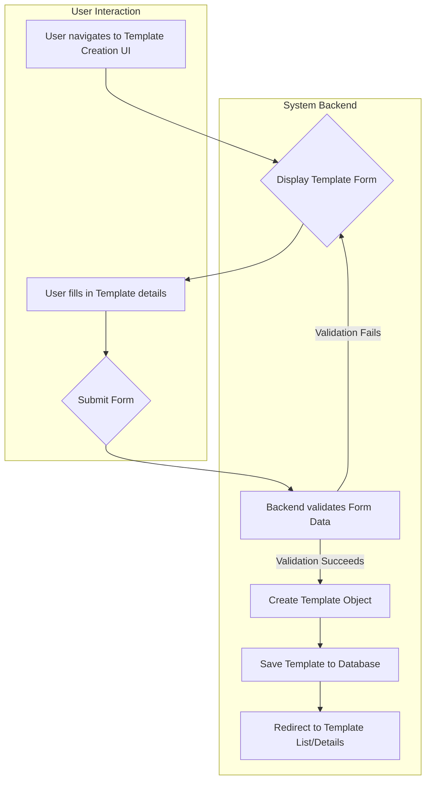

# Template Creation Process

This document outlines the process for creating a new game template within the QuestForge application. Templates serve as reusable blueprints for generating unique game instances.

## Process Flow

## Detailed Steps

1.  **Navigate to Creation UI (User Action):**
    *   The user accesses the template creation interface, typically via a URL like `/templates/create`.
    *   This route is handled by a function within `questforge/views/template.py`.

2.  **Display Template Form (System):**
    *   The backend view renders the template creation form (`questforge/templates/template/create.html`).
    *   This form is likely defined using Flask-WTF in `questforge/views/forms.py` (e.g., `TemplateForm`).
    *   Fields correspond to the attributes of the `Template` model (`questforge/models/template.py`), such as:
        *   `name` (String)
        *   `description` (Text)
        *   `category` (String)
        *   `question_flow` (JSON Text Area)
        *   `default_rules` (JSON Text Area)
        *   `initial_state` (JSON Text Area)
        *   `ai_service_endpoint` (String)
        *   `ai_max_retries` (Integer)
        *   `ai_retry_delay` (Integer)

3.  **Fill Form (User Action):**
    *   The user provides the necessary details for the new template, including defining the structure for questions, rules, and the initial game state in JSON format.

4.  **Submit Form (User Action):**
    *   The user submits the completed form.

5.  **Validate Form Data (System):**
    *   The backend view receives the POST request.
    *   The Flask-WTF form validates the submitted data based on defined rules (e.g., required fields, data types, JSON validity).
    *   If validation fails, the form is re-rendered with error messages.

6.  **Create Template Object (System):**
    *   If validation succeeds, the view creates a new instance of the `Template` model.
    *   Data from the validated form is used to populate the attributes of the `Template` object. The `created_by` field is set to the current logged-in user's ID.

7.  **Save Template to Database (System):**
    *   The new `Template` object is added to the database session and committed.
    *   `db.session.add(new_template)`
    *   `db.session.commit()`

8.  **Redirect (System):**
    *   The user is typically redirected to the list of templates (`/templates/list`) or the detail page for the newly created template, often with a success message (flash message).

## Key Components

*   **Model:** `questforge/models/template.py` (Defines the data structure)
*   **View:** `questforge/views/template.py` (Handles request logic, form processing, database interaction)
*   **Form:** `questforge/views/forms.py` (Defines form fields and validation rules - assumed location)
*   **Template (HTML):** `questforge/templates/template/create.html` (Renders the user interface)
*   **Database:** Stores the created template records.

## Considerations

*   **JSON Validation:** Robust validation of the JSON fields (`question_flow`, `default_rules`, `initial_state`) is crucial on the backend to prevent errors during game creation.
*   **User Experience:** Providing clear instructions and potentially a JSON editor or schema validation in the UI can improve the template creation experience.
*   **Security:** Ensure proper authorization checks so only permitted users can create templates. CSRF protection should be active via Flask-WTF.
