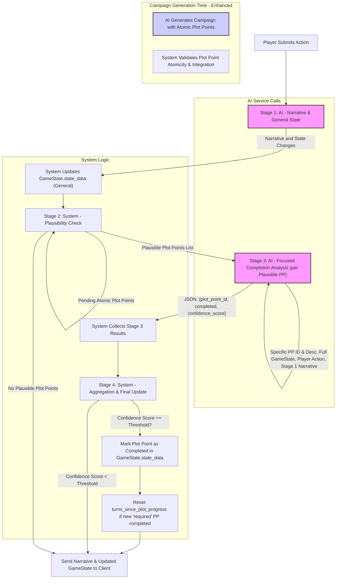

# Plot Point Maintenance Flow

```mermaid
flowchart TD
    A["Player Submits Action"] --> B["Stage 1: AI - Narrative & General State"]
    B -->|"Narrative and State Changes"| C["System Updates GameState.state_data (General)"]
    C --> D["Stage 2: System - Plausibility Check"]
    D -->|"Pending Atomic Plot Points"| D
    D -->|"Plausible Plot Points List"| E["Stage 3: AI - Focused Completion Analysis (per Plausible PP)"]
    E -->|"Specific PP ID & Desc, Full GameState, Player Action, Stage 1 Narrative"| E
    E -->|"JSON: {plot_point_id, completed, confidence_score}"| F["System Collects Stage 3 Results"]
    F --> G["Stage 4: System - Aggregation & Final Update"]
    G -->|"Confidence Score >= Threshold?"| H["Mark Plot Point as Completed in GameState.state_data"]
    H --> I["Reset turns_since_plot_progress if new 'required' PP completed"]
    I --> J["Send Narrative & Updated GameState to Client"]
    G -->|"Confidence Score < Threshold"| J
    D -->|"No Plausible Plot Points"| J
    
    subgraph CampaignGen["Campaign Generation Time - Enhanced"]
        CG1["AI Generates Campaign with Atomic Plot Points"]
        CG2["System Validates Plot Point Atomicity & Integration"]
    end
    
    subgraph AIService["AI Service Calls"]
        B
        E
    end
    
    subgraph SystemLogic["System Logic"]
        C
        D
        F
        G
        H
        I
    end
    
    style B fill:#f9f,stroke:#333,stroke-width:2px
    style E fill:#f9f,stroke:#333,stroke-width:2px
    style CG1 fill:#ccf,stroke:#333,stroke-width:2px
```